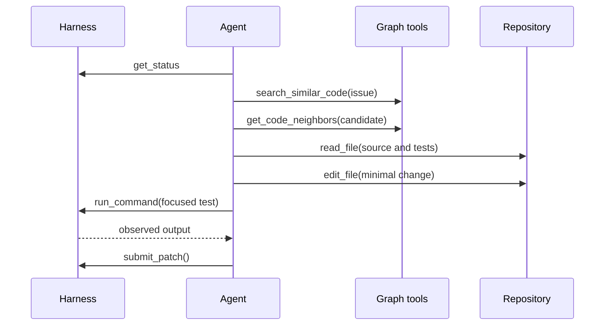

# Agent workflow

```mermaid
sequenceDiagram
  participant H as Harness
  participant A as Agent
  participant G as Graph tools
  participant R as Repository
  A->>H: get_status
  A->>G: search_similar_code(issue)
  A->>G: get_code_neighbors(candidate)
  A->>R: read_file(source and tests)
  A->>R: edit_file(minimal change)
  A->>H: run_command(focused test)
  H-->>A: observed output
  A->>H: submit_patch()
```
